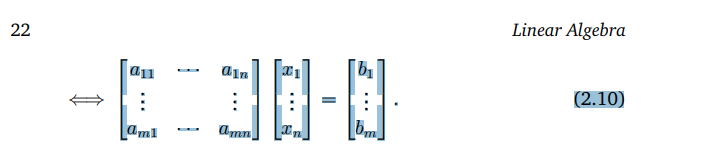

{What are linear equations}
{examples of linear equations}
{no solution, unique solution, multiple solutions}

 -> Create and explain this notation

{solving them}
{particular and general solutions}